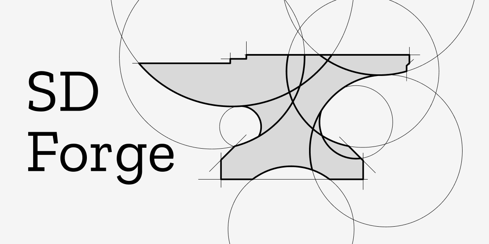

# SDForge

Welcome to **SDForge**!

SDForge is an experimental, browser-based 3D modeling environment built around Signed Distance Functions (SDFs).
Instead of traditional polygon meshes, SDForge represents shapes mathematically, enabling smooth boolean operations, infinite resolution surfaces, and procedural composition.
To run the demo, access [Live Demo](https://shuemaker70969.github.io/SDForge/)

## Controls

### Camera

| Input | Action |
|------|-------|
| Mouse wheel click + drag | Rotate camera |
| Shift + mouse wheel click + drag | Pan camera |
| Mouse wheel scroll | Zoom |

### Interaction

| Input | Action |
|------|-------|
| Left click | Select shape |
| Shift + Left click | Select multiple shapes |

### Shortcut Keys
|------|-------|
| Shift + a | Add shape to scene |
| x | delete selected shape |
| Shift + a | Add shape to scene |
| Shift + d | Duplicate active shape |
| g | Enter translation mode |
| r | Enter rotation mode |
| s | Enter scale mode |
| During transformation mode (x | y | z) | Transform in selected axis |
| escape | Exit transformation mode |
